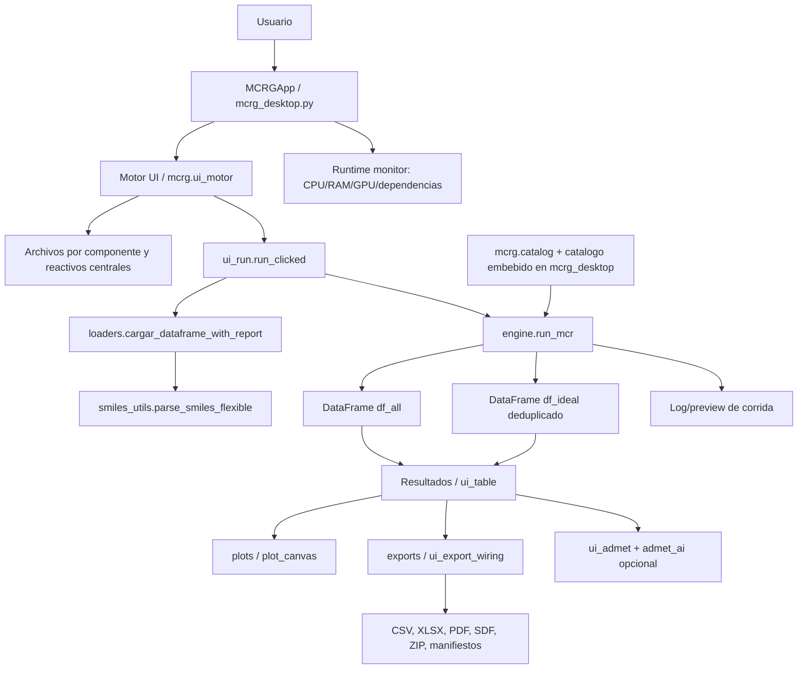
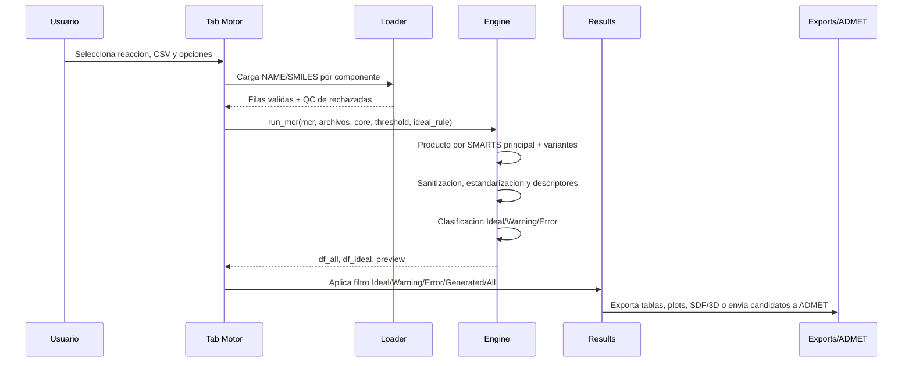
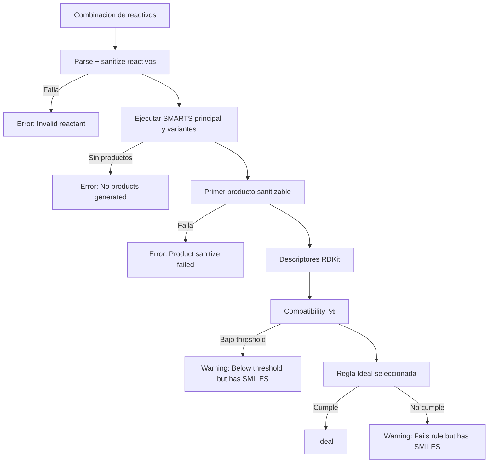
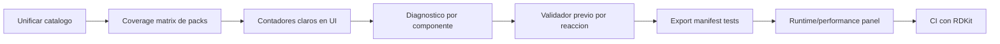

# Visualizacion operativa y auditoria de Moleku

Este documento resume como fluye la plataforma, donde se corrigio el problema de GBB/Gewald y que puntos conviene pulir para reducir reportes de usuarios sobre resultados vacios, descartes masivos o diagnosticos poco claros.

## 1. Mapa general

## 2. Flujo de datos de una corrida

## 3. Capas principales

| Capa | Archivos clave | Responsabilidad | Riesgo actual |
| --- | --- | --- | --- |
| Entrada desktop | `mcrg_desktop.py` | Estado global, carga perezosa de RDKit/Pandas/Pillow, wiring de UI | Catalogo duplicado frente a `mcrg/catalog.py` |
| Catalogo | `mcrg/catalog.py`, bloque `MCR_CATALOGO` en `mcrg_desktop.py` | Define componentes, SMARTS, reactivos centrales, producto ejemplo | Riesgo de divergencia si se actualiza solo una copia |
| Carga de datos | `mcrg/loaders.py`, `mcrg/smiles_utils.py` | Lee CSV/TXT/XLSX/etc., normaliza columnas, valida SMILES | El usuario ve el fallo tarde si todo queda filtrado |
| Motor | `mcrg/engine.py` | Enumeracion cartesiana, reacciones RDKit, descriptores, reglas Ideal/Discard | Reglas complejas necesitan tests dorados por reaccion |
| Resultados | `mcrg/ui_results.py`, `mcrg/ui_table.py` | Tabla, filtros, 2D preview, contadores | Contadores mezclan intentos, productos y deduplicacion |
| Visualizacion | `mcrg/plot_canvas.py`, `mcrg/plots.py` | Histogramas, scatter, Chemical Space/export plots | Filtros y duplicados deben explicarse con claridad |
| Exportacion | `mcrg/exports.py`, `mcrg/ui_export_wiring.py` | CSV/XLSX/PDF/SDF/ZIP, QC, schema, manifiestos | Requiere tests de manifiesto/contexto para cada corrida |
| ADMET | `mcrg/ui_admet.py`, `mcrg/ui_admet_tab.py` | Prediccion local opcional y flujo de candidatos Ideal/Warning | `admet-ai` es opcional y puede fallar por entorno |
| Runtime monitor | `mcrg/runtime_monitor.py`, `mcrg/ui_motor.py`, `mcrg/ui_admet_tab.py` | Estado RDKit/Pandas/Pillow/ADMET y uso CPU/RAM/GPU | GPU depende de `nvidia-smi`; en CPU-only muestra `n/a` |
| Ejemplos | `examples/*.csv`, `examples/README.md` | Packs oficiales para usuarios | Deben mantenerse alineados con el alcance real del motor |
| Tests | `tests/*` | Regresiones de motor, export y carga | Conviene cubrir packs oficiales completos, no solo casos unitarios |

## 4. Estado de GBB/Gewald tras la correccion

Validado localmente con RDKit 2026.03.1 y los CSV oficiales en `examples/`.

| Reaccion | Antes | Despues | Comentario |
| --- | ---: | ---: | --- |
| Biginelli pack oficial | 63 Ideal / 63 intentos | 63 Ideal / 63 intentos | Se mantiene estable |
| GBB pack oficial | 0 Ideal / 504 intentos | 231 Ideal / 504 intentos | Ademas hay 93 productos generados que fallan Lipinski y 180 combinaciones sin producto |
| Gewald pack oficial | 28 Ideal / 54 intentos | 45 Ideal / 54 intentos | Se rescatan acetona, acetofenona y malononitrilo |

Cambios aplicados:

- GBB usa ahora un SMARTS neutral para evitar productos cargados que RDKit no podia kekulizar.
- Gewald acepta ketonas con carbono alfa `CH3/CH2/CH`, no solo `CH2`.
- Gewald agrega una variante para malononitrilo, produciendo aminotiofenos con nitrilo.
- El motor prueba SMARTS principal + variantes y elige el primer producto sanitizable.
- La deteccion de posicion del reactivo central tambien prueba variantes, importante cuando el CSV solo contiene el sustrato de variante.
- Los tests dorados ahora exigen productos en GBB/Gewald y los packs oficiales deben producir al menos un Ideal.

## 5. Clasificacion Ideal/Warning/Error

Notas importantes para producto:

- `df_all` conserva todos los intentos evaluados.
- `df_ideal` se deduplica por InChIKey cuando es posible.
- `Warning` conserva `SMILES_Final` y puede exportarse en 3D bajo criterio del usuario.
- `Error` agrupa intentos sin producto valido y no se exporta a 3D.

## 6. Puntos a pulir priorizados

Estado: esta tanda ya deja trabajo aplicado sobre los 12 puntos. Algunos quedan como base implementada + siguiente mejora incremental, no como cierre absoluto de producto.

### P0: evitar reportes de "todo falla"

1. Unificar el catalogo.
   - Hoy hay dos fuentes: `mcrg/catalog.py` y `mcrg_desktop.py`.
   - Aplicado: `mcrg_desktop.py` usa el catalogo modular como fuente activa y hay test de sincronizacion.

2. Matriz de cobertura por pack oficial.
   - Aplicado: test de packs oficiales y tabla de cobertura en `examples/README.md`.
   - Siguiente mejora: publicar tambien desglose por reactivo en export QC.

3. Semantica de contadores.
   - Separar en UI: `Intentos evaluados`, `Productos validos`, `Ideal unicos`, `Discarded`.
   - Aplicado: contadores compactos `Eval / Products / Ideal / Discard / Rxn fail` desde `df_all.attrs["run_summary"]`.

4. Diagnostico por componente.
   - Aplicado: preflight por componente, top causas y hints en consola de corrida.

### P1: mejorar confianza del usuario

5. Validador previo por reaccion.
   - Aplicado: preflight contra templates RDKit antes de la enumeracion.
   - Siguiente mejora: convertirlo en bloqueo opcional antes de lanzar la corrida larga.

6. Contexto de exportacion completo.
   - Corregido: `ui_run` ahora guarda `ideal_rule` y `standardize` en `_last_run_context`.
   - Aplicado: Paper ZIP manifest incluye ambos campos y el test lo verifica.

7. Estado de dependencias.
   - Aplicado: panel Runtime muestra RDKit/Pandas/Pillow/ADMET en Motor y ADMET.
   - Siguiente mejora: deshabilitar `Start` hasta `Ready`.

8. ADMET local.
   - Aplicado: el panel Runtime indica si `admet-ai` esta disponible antes de usarlo.
   - Siguiente mejora: mostrar version exacta de `admet-ai`.

### P2: mantenibilidad y experiencia

9. Reducir duplicacion de filas de fallo.
   - Aplicado: helper interno `_discard_row(...)` para descartes sin producto.

10. Mensajes de ayuda ligados a resultados reales.
    - Aplicado: hints automaticos para regla Ideal, threshold, GBB y Gewald.

11. Pack examples curado por alcance.
    - GBB aun descarta aminoazinas fuera del SMARTS actual, como el triazol y el quinolino del pack.
    - Gewald aun descarta el cianoester alfa-sustituido por sanitizacion.
    - Aplicado: `examples/README.md` declara cobertura esperada y advierte si una corrida oficial da `0 Ideal`.
    - Siguiente mejora: separar reactivos experimentales si se desea una demo 100% limpia.

12. CI reproducible.
    - `pytest.ini` ahora incluye `pythonpath = .`.
    - Aplicado: CI conserva job con RDKit/conda-forge y suma smoke import sin stack quimico.

13. Panel de rendimiento.
    - Aplicado: panel tipo lectura tecnica con CPU del proceso, RAM del proceso y GPU/VRAM si `nvidia-smi` esta disponible.
    - En equipos sin GPU NVIDIA o sin acceso a driver, muestra `GPU: n/a` sin romper la app.

## 7. Roadmap sugerido

## 8. Archivos tocados por esta correccion

- `mcrg/engine.py`: soporte de SMARTS variantes, seleccion de primer producto sanitizable y core insertion con variantes.
- `mcrg/catalog.py`: SMARTS corregidos para GBB/Gewald y variante Gewald-malononitrilo.
- `mcrg_desktop.py`: catalogo embebido sincronizado con los cambios.
- `mcrg/ui_run.py`: contexto de exportacion conserva `ideal_rule` y `standardize`.
- `mcrg/run_counts.py`: resumen compacto para contadores de Motor/Results.
- `mcrg/runtime_monitor.py`: estado de dependencias y uso CPU/RAM/GPU.
- `tests/test_golden_reactions.py`: regresiones GBB, Gewald-malononitrilo y packs oficiales.
- `tests/test_golden_catalog_coverage.py`: GBB/Gewald pasan de fallos esperados a productos esperados.
- `tests/test_run_mcr.py`: valida SMARTS principal y variantes.
- `pytest.ini`: imports locales consistentes para `pytest`.

## 9. Criterio de aceptacion recomendado

Antes de entregar una version a usuarios:

1. `pytest -q` pasa en el entorno de desarrollo.
2. Los packs oficiales generan al menos un Ideal por reaccion core.
3. La UI muestra conteos separados de intentos, productos validos, Ideal unicos y descartes.
4. Cada pack oficial tiene una tabla de cobertura publicada en `examples/README.md`.
5. Todo ZIP de resultados incluye `mcr`, `threshold`, `ideal_rule`, `standardize`, reactivos centrales e hashes de entrada.
